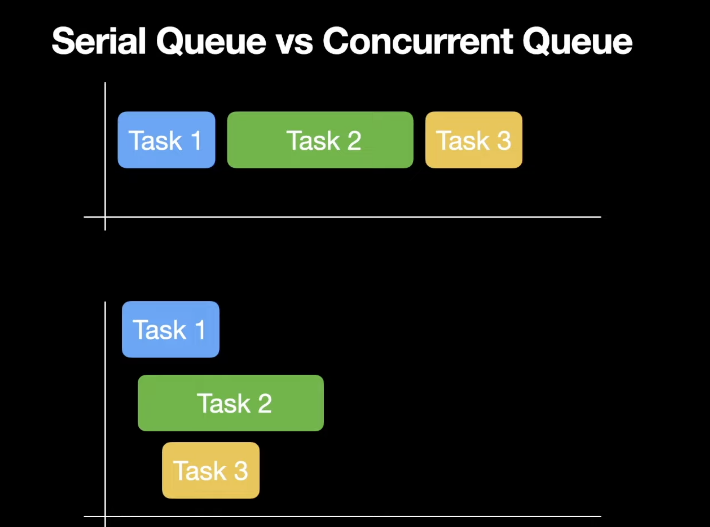

# Part 1 (Concurrency, GCD Basics)


### What is Concurrency?
- Programming: Concurrency is the execution of multiple instruction sequences at the same time

### What is Parallelism?
- Dictionary: The state of being parallel or of corresponding in some way
- It is the use of multiple processing elements simultaneously for solving any problem/
- Problems are broken down into instructions and are solved concurrently as each resource that has been applied to work is working at the same time.


## Concurrency vs Parallelism

- Concurrent 
  - 2 queues, 1 vending machines

- Parallel
  - 2 queues, 2 vending machines

## How Concurrency is Achieved
- Time slicing and Context switching
  - Interruptions
    - Pause a certain duration of time
    - Task 1 -> Task 2 -> Task 1 -> Task 2 ...
  - Scheduling algorithm
  - Latency
  - Time quantum

## Problems with Concurrency
- Dirty Read Problem
- Unrepeatable Read Problem
- Lost Update Problem
- Phantom Read Problem

--> Data inconsistency

## Concurrency in iOS
- Achieving multithreading by creating threads manually
- Grand Central Dispatch
- Operation Queues
- Modern Concurrency in Swift

## Manual Thread Creation
- Raw
- More control and customization
  - Start
  - Cancel
  - Delay
  - Stack size
- Responsibility to manage the threads with system conditions
- Deallocation once they have finished executing
- Improper management may cause memory leak in app
- Auto release pool will not manage threads created by us
- Maintaining the order of execution

```swift
class CustomThread {
    func createThread() {
        let thread: Thread = Thread(target: self, selector: #selector(threadSelector), object: nil)
        thread.start()
    }
    
    @objc func threadSelector() {
        print("Custom Thread in action")
    }
}

let customThread = CustomThread()
customThread.createThread()

```

## Grand Central Dispatch
- Dispatch
  - Execute code concurrently on multicore hardware by submitting work to dispatch queues managed by the system.
- GCD is a queue-based API that allows to execute closures on worker pools in the FIFO order.
- Task Queue, Thread Pool, Completed Tasks
- Which thread is used to execute a task is handled by GCD, not the developer and executes them on an appropriate dispatch queue

## Dispatch queue
- It is the abstraction layer on top of the queue.
- GCD manages a collection of dispatch queues. They are usually referred as queues. The work submitted to these dispatch queues is executed on a pool of threads. 
- A dispatch queue executes tasks either serially or concurrently but always in a FIFO order. 

**Order of execution**rially or concurrently

**Manner of execution**
 - how the job will be executed. Block your current execution?
  

## Synchronous vs Asynchronous
- Synchronous
  - block the execution til
- the tasks will be picked up sel this task is completed
- Asynchronous
  - Continue the execution of the current task, while the new task will execute asynchronously

Control returns from the method immediately and start executing other tasks

## Serial Queue vs Concurrent Queue
- Serial Queue
  - One task at a time.
- Concurrent Queue
- Multiple tasks at a time




```swift
var counter = 1

DispatchQueue.main.async {
    for i in 0...3 {
        counter = i
        print("\(counter)")
    }
}

for i in 4...6 {
    counter = i
    print("\(counter)")
}

DispatchQueue.main.async {
    counter = 9
    print(counter)
}

/**
4
5
6
0
1
2
3
9
**/
```